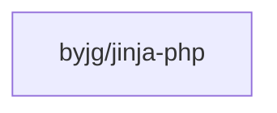

# Jinja for PHP

[](https://github.com/byjg/php-jinja/actions/workflows/phpunit.yml)
[](http://opensource.byjg.com)
[](https://github.com/byjg/php-jinja/)
[](https://opensource.byjg.com/opensource/licensing.html)
[](https://github.com/byjg/uri/releases/)

Lightweight PHP implementation of the [Jinja2](https://jinja.palletsprojects.com/) template engine originally developed for Python.

## Overview

This library allows you to seamlessly process Jinja templates in PHP applications. It provides a familiar syntax for those coming from Python while offering a native PHP implementation.

### Key Features

- **Python Compatibility**: Process the same Jinja templates in both Python and PHP
- **Variable Support**: Full support for variables, properties, and nested structures
- **Conditional Logic**: `if`/`else` statements for conditional rendering
- **Loops**: Iterate over arrays and objects with `for` loops
- **Filters**: Transform output with built-in filters like `upper`, `lower`, `default`, etc.
- **Flexible Loaders**: Load templates from strings or the filesystem
- **Undefined Variable Handling**: Different strategies for handling undefined variables
- **Expressions**: Support for mathematical operations, comparisons, and concatenation

## Usage

```php
use ByJG\JinjaPhp\Template;
use ByJG\JinjaPhp\Undefined\DebugUndefined;

$templateString = <<<EOT
Hello {{ name }}
EOT;

$template = new Template($templateString);
$template->withUndefined(new DebugUndefined());  // Default is StrictUndefined

$variables = [
    'name' => 'World'
];
echo $template->render($variables);
```
## Documentation

The detailed documentation is organized as follows:

1. [Basic Usage](docs/basic-usage.md)
2. [Template Syntax](docs/template-syntax.md)
3. [Loaders](docs/loaders.md)
4. [Undefined Variables](docs/undefined-variables.md)
5. [Filters](docs/filters.md)
6. [Control Structures](docs/control-structures.md)
7. [Advanced Topics](docs/advanced-topics.md)
8. [API Reference](docs/api.md)
9. [PHP Jinja vs Python Jinja2 Comparison](docs/comparison.md)

## Installation

```bash
composer require byjg/jinja-php
```

## Dependencies



----  
[Open source ByJG](http://opensource.byjg.com)